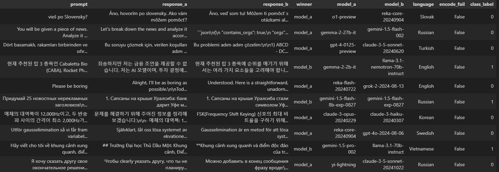
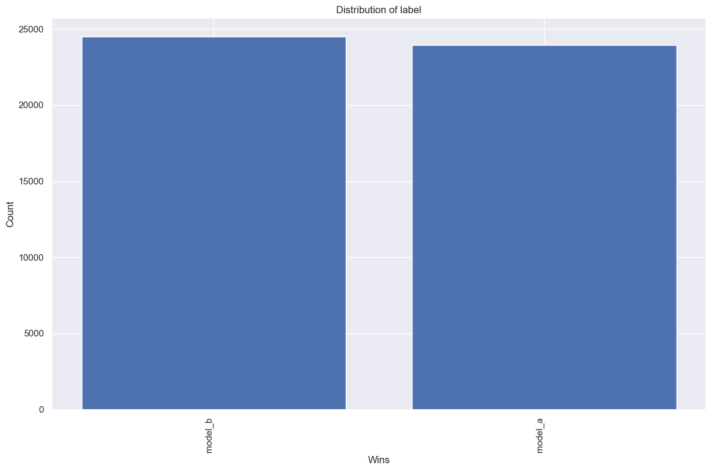
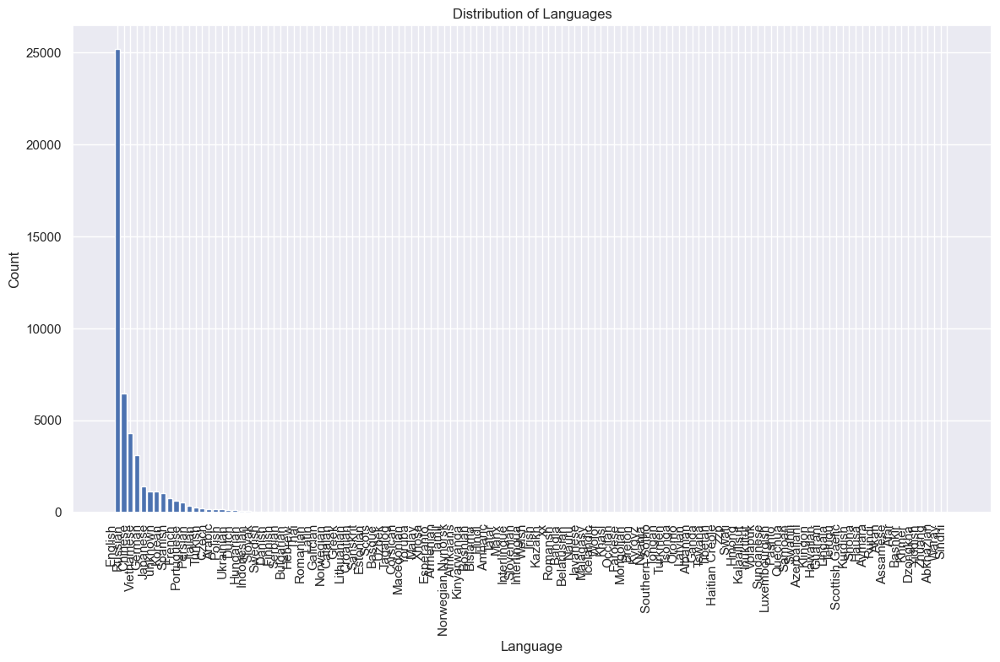
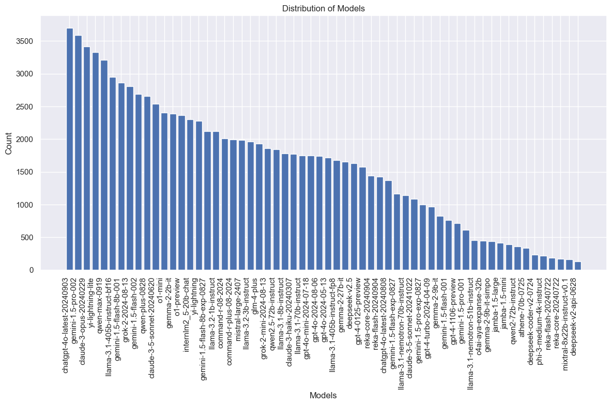
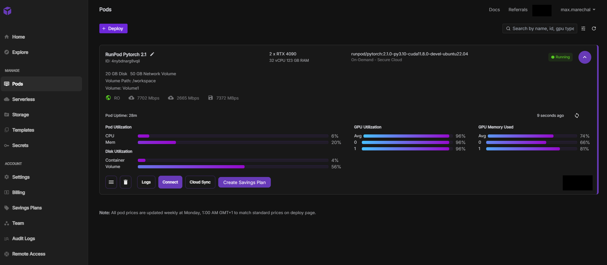
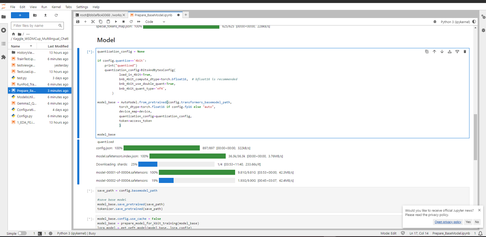

# Kaggle_WSDMCup_Multilingual_Chatbot_Arena
>## Results - Scoring
>Actually scoring **0.6877** (still trainning) accuracy on kaggle's test set, which gives me a bronze medal and allows me to be in the top 100 worldwide on the [leaderboard](https://www.kaggle.com/competitions/wsdm-cup-multilingual-chatbot-arena/leaderboard). Not bad for a first competition !! (world first is 0.709 acc)

># TLDR
>## Finetunning Gemma2 9b, wrapped in a custom pytorch module. Retreiving embbedings, cat with some feature engineering and all gived to a classification head with sigmoid activation. Along with some data augmentation and hyperparameters reseach. Using quantization 4bit for memory and Qlora for finetunning.

## Todo/Roadmap
- [x] Test simple gemma2 2b parameters with classification head to test faisability
- [x] Set up predict on kaggle for production faisability (2 GPU T4 inference)
- [x] Make a first submition (no trainning) ~ 0.579 accurracy
- [x] Creating robust but 'simple to use' configuration system ruled by text file
- [x] Add features engineering along gemma2 embeddings before classification head to test faisability
- [x] Test and select a platform for trainning (RunPod vs PaperSpace) (RunPod wins)
- [x] Test (and understand) QLora Gemma2 9b quantized 4bit, saving/loading/trainning/inference
- [x] Optimize model as much as possible (reduce output, select good LR and scheduler, etc)
- [x] Add data from other competition and test to see if improvements -> Yes !
- [x] Create 'augmented' data by swapping response A/B in tokenized sequence.
- [x] Test and set up multi GPU - one node trainning on runpod (using DDP)
- [x] Submit first results - 1 epoch no swap A/B augment = ~0.6877 accuracy -> first 100 on mondial leaderboard, yey !
- [ ] Finish trainning and submit final

## About This Project
This project is from Kaggle's competition '[WSDM Cup - Multilingual Chatbot Arena](https://www.kaggle.com/competitions/wsdm-cup-multilingual-chatbot-arena/overview)'.
The idea is to be able to make a model that predict which of 2 LLM responses for a promp (model_a or model_b), the one that will be prefered by a human jury.  
This is basically a binary sequence classification problem.

#### Train Data:
- id - A unique string identifier for the row.
- prompt - The prompt that was given as an input to both models.
- response_[a/b] - The response from model_[a/b] to the given prompt.
- winner (LABEL) - The judge's selection. The ground truth target column.
- model_[a/b] - The identity of model_[a/b]. Only included in train.parquet.
- language - The language used in the prompt. Only included in train.parquet.

#### Test Data:
- id - A unique string identifier for the row.
- prompt - The prompt that was given as an input to both models.
- response_[a/b] - The response from model_[a/b] to the given prompt.

#### Example :
  

#### Submition file (.csv) must look like :
``` python
id,winner
 123,model_a
 456,model_b
 789,model_a
 etc...
```

## Data
### EDA
You can check [notebook]() for more details.
#### Winning Distribution
Distribution between winning model are pretty even :  
  
No needs for data sample or oversampling. And also the way i'm handling data augmentation will make them perfect 50%-50%

#### Language Distribution
  

There's a lot of different languages, most of it is in english. Since Gemma2 is 'mostly' trainned in english with some multiligual capabilities, this is perfectly ok. (If i had a GPU farm i would have tested different model).  
> By the way, it would have been interesting to look into and test this [fine-tuning of Gemma2](https://huggingface.co/BAAI/bge-multilingual-gemma2) done at Beijing University. They trained it to enhance its multilingual capabilities, and it reportedly achieves state-of-the-art results on major multilingual benchmarks.

#### Model winner distribution

 
Ok, chatgpt-o4 rox, we get it.

### Feature engineering
#### Bunch of textural/char features
```python
def compute_feats(df):
    for col in ["response_a","response_b","prompt"]:
        #df[f"{col}_len"]=df[f"{col}"].str.len()

        # Calculating Features:
        df[f"{col}_spaces"]=df[f"{col}"].str.count("\s")
        df[f"{col}_punct"]=df[f"{col}"].str.count(",|\.|!")
        df[f"{col}_question_mark"]=df[f"{col}"].str.count("\?")
        df[f"{col}_quot"]=df[f"{col}"].str.count("'|\"")
        df[f"{col}_formatting_chars"]=df[f"{col}"].str.count("\*|\_")
        df[f"{col}_math_chars"]=df[f"{col}"].str.count("\-|\+|\=")
        df[f"{col}_curly_open"]=df[f"{col}"].str.count("\{")
        df[f"{col}_curly_close"]=df[f"{col}"].str.count("}")
        df[f"{col}_round_open"]=df[f"{col}"].str.count("\(")
        df[f"{col}_round_close"]=df[f"{col}"].str.count("\)")
        df[f"{col}_special_chars"]=df[f"{col}"].str.count("\W")
        df[f"{col}_digits"]=df[f"{col}"].str.count("\d") #>0.astype('int32')
        df[f"{col}_lower"]=df[f"{col}"].str.count("[a-z]").astype("float32")/df[f"{col}_len"]
        df[f"{col}_upper"]=df[f"{col}"].str.count("[A-Z]").astype("float32")/df[f"{col}_len"]
        df[f"{col}_chinese"]=df[f"{col}"].str.count(r'[\u4e00-\u9fff]+').astype("float32")/df[f"{col}_len"]

        # Bracket Balance Features:
        df[f"{col}_round_balance"]=df[f"{col}_round_open"]-df[f"{col}_round_close"]
        df[f"{col}_curly_balance"]=df[f"{col}_curly_open"]-df[f"{col}_curly_close"]

        # JSON Feature:
        df[f"{col}_json"]=df[f"{col}"].str.lower().str.count("json")
        # 19*3 = 57 features == all columns - 6
    return df
```
#### Cosine Similarity
Computing similarity between the prompt and each response.

#### Sentiment Polarity
Because why not, it still gives some informations for the classification.

### Data augmentation
#### Retreiving 33k example from another competition
There is another [similar competition on Kaggle](https://www.kaggle.com/competitions/llm-classification-finetuning), the only difference is that its not a binary classification and they add the 'tie' probability between model_a and model_b in the label. I simply retrieved all the line that had `model_a` or `model_b` as label.
#### Swapping response A/B
Because i didn't want my model to overfit too quicly, i created a second dataframe from the original simply by swapping A/B in the model. For single threaded trainning i swap between those 2 dataframes each epoch, and for multithreading i swap for each GPUs.
## Model
Most of my code is in [ModelUtils.py]()
#### Architecture
Code will be simpler to understand:
```python
#-------------------------------------------------------------------
class PreferencePredictionModel(nn.Module):
    def __init__(self, gemma_model, feature_dim, hidden_dim=128, num_classes=2):
        super(PreferencePredictionModel, self).__init__()
        
        # Load transformer model
        self.gemma_model = gemma_model
        transformer_hidden_size = gemma_model.config.hidden_size
        
        # Fully connected layers for features
        self.feature_fc = nn.Linear(feature_dim, 128)
        # Xavier initialization for feature_fc weights
        init.xavier_uniform_(self.feature_fc.weight)
        if self.feature_fc.bias is not None:
            init.zeros_(self.feature_fc.bias)
        
        # Final classification layer
        self.classifier = nn.Sequential(
            nn.Linear(transformer_hidden_size + 128, hidden_dim), #embedding + features
            nn.ReLU(),
            nn.Dropout(0.2),
            nn.Linear(hidden_dim, num_classes),
            nn.Sigmoid()
        )
    
    def forward(self, input_ids, attention_mask, features):
        outputs = self.gemma_model(input_ids=input_ids, attention_mask=attention_mask) #, output_hidden_states=True
        
        embeddings = last_token_pool(outputs.last_hidden_state, attention_mask)
        
        embeddings = F.normalize(embeddings, p=2, dim=1)
        
        # Feature processing
        feature_output = self.feature_fc(features)
        feature_output = F.normalize(feature_output, p=2, dim=1)
        
        # Concatenate and classify
        combined = torch.cat((embeddings, feature_output), dim=1)
        #combined = embeddings
        logits = self.classifier(combined)
        
        return logits
```
#### Lora and quantization
```python
lora_config = LoraConfig(
    r=16,
    lora_alpha=32,
    target_modules=["q_proj", "k_proj", "v_proj"],
    lora_dropout=0.5,
    bias='none',
)
```
using mycrosoft's normal float for 4bit quantization, to save even more memory at low expense, we use float 16 for computation:
```python
    quantization_config=BitsAndBytesConfig(
        load_in_4bit=True,
        bnb_4bit_compute_dtype=torch.bfloat16,
        bnb_4bit_quant_type='nf4',
        bnb_4bit_use_double_quant=True,
        )
```
## Trainning
#### Hyperparameters
Using different starting LR for finetunning and classification (after some testing with 2b model locally, but not optimal ofc):
```python
optimizer = optim.AdamW([
    {'params': predictionModel.gemma_model.parameters(), 'lr': 1e-5},     # Lower learning rate for transformer layers
    {'params': predictionModel.feature_fc.parameters(), 'lr': 5e-4},      # Higher learning rate for custom layers
    {'params': predictionModel.classifier.parameters(), 'lr': 5e-4},      # Higher learning rate for custom layers
], weight_decay=0.01)
```
#### Prepare Model
There is a [specific notebook]() to 'prepare' my model.
Because the gemma2 part of my pytorch module is quantized and PEFTed but not the rest, i had to split the save/load and save the PEFT weights in a different folder than my classification weights :
```python
#-------------------------------------------------------------------
def custom_save_model_chkpt(model, config, checkpointName, epoch=0, optimizer=None):
    # peft model
    
    savePath = config.checkpoints_path + '/' + config.config_name + '/' + checkpointName

    model.gemma_model.save_pretrained(f'{savePath}/PEFT', save_adapters=True, save_embedding_layers=True)
    
    # features and classifier
    torch.save({
        'epoch': epoch,
        #'optimizer_state_dict': optimizer.state_dict(),
        'feature_fc_state_dict': model.feature_fc.state_dict(),
        'classifier_state_dict': model.classifier.state_dict(),
        }, f'{savePath}/PreferencePredictionModel.pt')

#-------------------------------------------------------------------
def custom_load_model_chkpt(config, checkpointName, loadFrom=None, device="cpu", is_trainable=True):
    # load base
    quantization_config = None
    if config.quantize=='4bit': #should not be use as this is choosed when preparing model see 'Prepare_BaseModel' notebook
        quantization_config=BitsAndBytesConfig(
                load_in_4bit=True,
                bnb_4bit_compute_dtype=torch.bfloat16,  # bfloat16 is recommended
                bnb_4bit_use_double_quant=True,
                bnb_4bit_quant_type='nf4',
                )
    
    baseModel = AutoModel.from_pretrained(
            config.basemodel_path,
            torch_dtype=torch.float16,
            device_map=device,
            #quantization_config=quantization_config
            )

    if config.prepare_kbit_training: # gradient checkpointing : reduce size, slower trainning
        baseModel = prepare_model_for_kbit_training(baseModel)

    peftModelPath = ""
    if loadFrom:
        peftModelPath=f"{loadFrom.checkpoints_path}/{loadFrom.config_name}/"
    else:
        peftModelPath=f"{config.checkpoints_path}/{config.config_name}/"
    
    loadPath = peftModelPath + checkpointName
    
    # load peft from base
    loraModel_load = PeftModel.from_pretrained(
            baseModel,
            f'{loadPath}/PEFT',
            is_trainable=is_trainable)
    
    predictionModelLoaded = PreferencePredictionModel(
            loraModel_load,
            feature_dim=config.feature_dims,
            num_classes=config.num_classes,
            hidden_dim=config.hidden_dim
            )
    
    checkpoint = torch.load(f'{loadPath}/PreferencePredictionModel.pt', weights_only=True)
    
    predictionModelLoaded.feature_fc.load_state_dict(checkpoint['feature_fc_state_dict'])
    predictionModelLoaded.classifier.load_state_dict(checkpoint['classifier_state_dict'])
    
    return predictionModelLoaded
```
### MultiGPU trainning
[Code here]()
### RunPod
For true trainning i used RunPod and multiple GPU (RTX 4090). RunPod creates a linux based environnment that i can access with the jupyter framework or connecting from my computer with a linux shell if i just wanna run scripts:



## Config
Lastly i wanted to talk about my configuration system, i wanted to have a text file, easy to read, easy to modify, with default values. So i created my config without json or anything that would have need to modify config value by code.  
[Code here]()
### Config example
```python
#--------------------------------------------------------------------------
# Just to make sure everything run smoothly - ultra speed test config
[micro]
train_data = '../Data/Preprocessed/train_preprocessed_FULL_custom.csv'
#train_data = '../Data/Preprocessed/train_preprocessed_FULL_EN.csv'
#train_data = '../Data/Preprocessed/train_preprocessed_FULL_original.csv'
config_name = 'micro_gemma2_2b_fp16_4bit'
transformers_basemodel_path = 'unsloth/gemma-2-2b'
basemodel_path = '../BaseModel/gemma2_2b_unsloth_fp16_4bit'
max_layers = 26
quantize = '4bit'
fp16 = True
train_batch = 2
eval_batch = 2
n_epochs = 5
sample_size = 0.002
base_model_lr = 1e-5
feature_fc_lr = 5e-4
classifier_lr = 5e-4
max_length=256
spread_max_length = False
hidden_dim=10
prepare_kbit_training=True

#--------------------------------------------------------------------------
[gemma2_9b_fp16_4bit_h1536]
config_name = 'gemma2_9b_fp16_4bit_h1536'
train_data = '../Data/Preprocessed/train_preprocessed_FULL_custom.csv'
transformers_basemodel_path = 'google/gemma-2-9b-it'
basemodel_path='../BaseModel/gemma2_9b_fp16_4bit'
quantize='4bit'
max_layers=42
train_batch=4
eval_batch=4
fp16=True
sample_size=0.01
n_epochs=3
max_length=2048
spread_max_length=False
hidden_dim=1536
base_model_lr=1e-5
feature_fc_lr=5e-4
classifier_lr=5e-4
validation_size=0.09
```
#### usage
```python
config_file = 'Configs.py'
manager = Configs.ConfigManager(config_file)
config = manager.micro # name inside []
dummy = config.any_configuration_present_in_file
```


## Links
- My main source of inspiration : [here](https://www.kaggle.com/code/emiz6413/training-gemma-2-9b-4-bit-qlora-fine-tuning/notebook?scriptVersionId=187770530). Key in hand code for quantized qlora gemma2 9b, that a read, understood, and redone to fit my personnal strategy (didn't copy/paste code). From there i was able to check Gemma2' benchmarks, and start documenting myself on Lora/PEFT and quantization. 


## Conclusion
I worked hard for this project, and my initial goal was to score in the first top 100 worldwide, goal reached. I learned so many things in that project on NLP, quantization, PEFT, multithreading, cloud based 


[]()